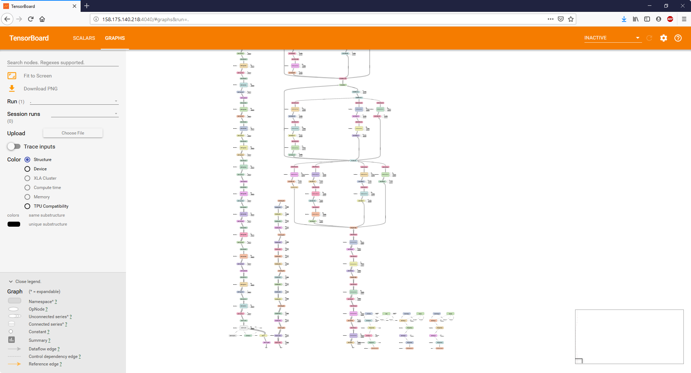
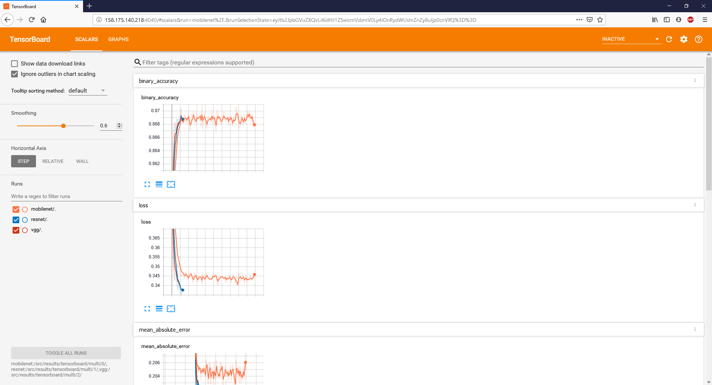

# Installation

## 1. Provision a cloud GPU machine

### Using AWS

If using AWS, as assumed by these setup instructions, provision an Ubuntu 18.04 `p2.xlarge` instance.  It's got older GPUs (Tesla K80) but is much cheaper.  Make sure to upgrade the storage space (e.g. 500 GB).  Also, make sure to pick a prebuilt Deep Learning AMI during the first step of the provisioning process. The most current version as of writing is `Deep Learning AMI (Ubuntu) Version 23.0 - ami-058f26d848e91a4e8`. This will already have `docker` and `nvidia-docker` pre-installed and will save you a lot of manual installation "fun".

### Using IBM Cloud

Provision a server to run the training code. You can you this server as your development environment too.

Install the CLI, add your ssh public key, and get the key id
```
curl -fsSL https://clis.ng.bluemix.net/install/linux | sh
ibmcloud login
ibmcloud sl security sshkey-add LapKey --in-file ~/.ssh/id_rsa.pub
ibmcloud sl security sshkey-list
```

Provision a V100 using this key id

```
ibmcloud sl vs create \
    --datacenter=wdc07 \
    --hostname=v100a \
    --domain=your.domain.com \
    --image=2263543 \
    --billing=hourly \
    --network 1000 \
    --key={YOUR_KEY_ID} \
    --flavor AC2_8X60X100 --san
```


Wait for the provisioning completion 
```
watch ibmcloud sl vs list
```

SSH on this host to setup the container.

```
ssh -i ~/.ssh/id_rsa {SERVER_IP}
```

>Note:You'll need to check-in your public SSH key in the keys folder and modify the last layer of the dockerfile to get access to the container from VsCode

Need to Add 2 TB secondary Hard-drive to Device via softlayer device list portal.

## 2. Clone the project repo

If you haven't already, clone the project Git repo to your instance.  Doing so in your home directory is convenient, and this document assumes you have done so.

```
cd ~
git clone https://github.com/paloukari/road-scanner
```

## 3. Get the data and build the `road_scanner` Docker image

Downloading and inflating the data, and building the development container has been automated in the [setup.sh](setup.sh) script.

```
TODO
```

## 4. Launch an `road_scanner` Docker container

Run the `road_scanner` Docker container with the following args.  

> NOTE: update the host volume mappings (i.e. `~/street-view-images`) as appropriate for your machine in the following script:

```
sudo docker run \
    --rm \
    --runtime=nvidia \
    --name road_scanner \
    -ti \
    -e JUPYTER_ENABLE_LAB=yes \
    -v ~/street-view-images:/src \
    -v /data:/src/data \
    -p 8888:8888 \
    -p 4040:4040 \
    -p 32001:22 \
    road_scanner
```

You will see it listed as `road_scanner` when you run `docker ps -a`.  

> Note: in the container, run `service ssh restart`, sometimes this is needed too to update the ssh settings.

### Verify Keras can see the GPU

Once inside the container, try running:

```
nvidia-smi
```

If it was successful, you should see a Keras model summary.

### Launch Jupyter Lab in the container

After you've started the container as described above, if you want to _also_ open a Jupyter notebook (e.g. for development/debugging), issue this command:

Inside the container bash, run :

```
jupyter lab --allow-root --port=8888 --ip=0.0.0.0
```

Then go to your browser and enter:

```
http://127.0.0.1:8888?token=<whatever token got displayed in the logs>
```

## 5. (Alternative) Manually setup the container for remote debugging

We need to setup the container to allow the same SSH public key. The entire section could be automated in the dockerfile. We can add our public keys in the repo and pre-authorize us at docker build.

To create a new key in Windows, run:

Powershell: 
```
Add-WindowsCapability -Online -Name OpenSSH.Client~~~~0.0.1.0
ssh-keygen -t rsa -b 4096 
```

The key will be created here: %USERPROFILE%\.ssh

Inside the container, set the root password. We need this to copy the dev ssh pub key.
```
passwd root
```
Install SSH server
```
apt-get install openssh-server
systemctl enable ssh
```
Configure password login
```
vim /etc/ssh/sshd_config
```
Change these lines of /etc/ssh/sshd_config:
```
PasswordAuthentication yes
PermitRootLogin yes
```
Start the service
```
service ssh start
```

Now, you should be able to login from your dev environment using the password.
```
ssh root@{SERVER_IP} -p 32001
```

To add the ssh pub key in the container, from the dev environment run:

```
SET REMOTEHOST=root@{SERVER_IP}:32001
scp %USERPROFILE%\.ssh\id_rsa.pub %REMOTEHOST%:~/tmp.pub
ssh %REMOTEHOST% "mkdir -p ~/.ssh && chmod 700 ~/.ssh && cat /tmp/tmp.pub >> ~/.ssh/authorized_keys && chmod 600 ~/.ssh/authorized_keys && rm -f /tmp/tmp.pub"
```

Test it works:
```
ssh -i ~/.ssh/id_rsa {SERVER_IP} -p 32001
```

Now, you can remove the password root access if you want.

In VsCode, install the Remote SSH extension.
Hit F1 and run VsCode SSH Config and enter 

```
Host V100
    User root
    HostName {SERVER_IP}
    Port 32001
    IdentityFile ~/.ssh/id_rsa
```
Hit F1 and select Remote-SSH:Connect to Host

Once in there, open the street-view-images folder, install the Python extension on the container (from the Vs Code extensions), select the python interpreter and start debugging.


## 6. Train the street-view-images

### Training

The model is trained through train.py.  The configuration of the models can be changed with a number of helper functions and parameters that are set in params.py.

To train a single model with mobilenet run the train() function in train.py.

To visualize results using tensorboard, use the terminal:
```
tensorboard --logdir=/src/results/tensorboard/single_model/ --port=4040
```

To train multiple models for comparison between mobilenet, VGG, and ResNet run the train_simple_multi() function in train.py.

To visualize results using tensorboard, use the terminal with paths to the models:
```
tensorboard --logdir=mobilenet:/src/results/tensorboard/multi/0/,resnet:/src/results/tensorboard/multi/1/,vgg:/src/results/tensorboard/multi/2/ --port=4040
```

#### Example Tensorboard Outputs





### Testing

TBD

# References
